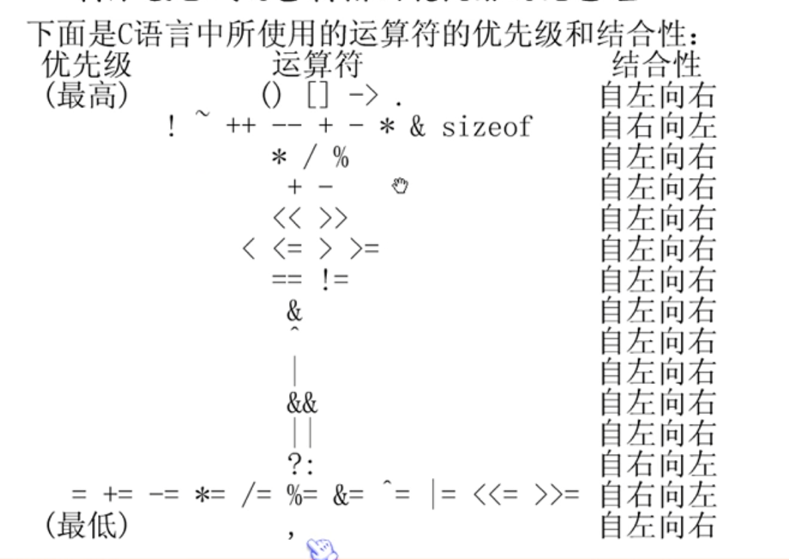

# learning-C

# ANSI C 关键字

32个

# 内存中的二进制存储

一个字节 byte = 8bit 数值是以补码来表示的

- 正数的补码和原码相同
- 负数的补码：将该数的绝对值的 二进制形式 按位取反 在加1

例如：求-10的补码

原码 0 0001010

取反 1 1110101

加一 1 1110110

第一位是符号位

# 阿斯克码

数字从65开始 + 32 表示对应的小写字母

~~~c
int main() {
    for (int i = 0; i < 256; ++i) {
        char c = i;
        if (c == 'A') {
            printf("%d\n", i); // 65
        }
        if (c == 'a') {
            printf("%", i); // 97
        }
    }
}
~~~

# 运算优先级
